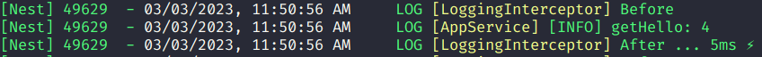

<h1>Structure As Common</h1>

<h2>For Projects NestJS</h2>

<h3>Installation</h3>

```bash
yarn add @williamkoller/structure-as-common
```

<h2>How To Use</h2>

<h3>If you want to use Logger</h3>

<h4>In AppModule</h4>

```ts
import { Module } from '@nestjs/common';
import { LoggerModule } from '@williamkoller/structure-as-common';
import { AppController } from './app.controller';
import { AppService } from './app.service';

@Module({
  imports: [LoggerModule.register()],
  controllers: [AppController],
  providers: [AppService],
})
export class AppModule {}
```

<h4> In AppService</h4>

```ts
import { Injectable } from '@nestjs/common';
import { LoggerService } from '@williamkoller/structure-as-common';

@Injectable()
export class AppService {
  constructor(private readonly logger: LoggerService) {}
  getHello(id: number): string {
    this.logger.log('AppService', `getHello: ${id}`);
    return `id: ${id}`;
  }
}
```

<h4>If you want to use HttpExceptionFilter</h4>

<h4>In main.ts</h5>

```ts
import { ValidationPipe } from '@nestjs/common';
import { NestFactory } from '@nestjs/core';
import {
  HttpExceptionFilter,
  LoggerService,
} from '@williamkoller/structure-as-common';
import { AppModule } from './app.module';

async function bootstrap() {
  const app = await NestFactory.create(AppModule);

  app.useGlobalPipes(new ValidationPipe({ transform: true }));
  app.useGlobalFilters(new HttpExceptionFilter(new LoggerService()));

  await app.listen(3001);
}
bootstrap();
```

<h4>LogginInterceptor Log</h4>


<h4>If you want to use TimeoutInterceptor and LoggingInterceptor</h4>

<h4>In main.ts</h4>

```ts
app.useGlobalInterceptors(new TimeoutInterceptor(), new LoggingInterceptor());
```

<h4>If you to use ValidationParamsPipe</h4>

<h4>In AppController</h4>

```ts
import { Controller, Get, Param, ParseIntPipe } from '@nestjs/common';
import { ValidationParamsPipe } from '@williamkoller/structure-as-common';
import { AppService } from './app.service';

@Controller('app')
export class AppController {
  constructor(private readonly appService: AppService) {}

  @Get('find-by-id/:id')
  getHello(
    @Param('id', ValidationParamsPipe, ParseIntPipe)
    id: number
  ): string {
    return this.appService.getHello(id);
  }
}
```

<h4>If you to use Exception</h4>

<h4>In AppModule</h4>

```ts
import { Module } from '@nestjs/common';
import {
  ExceptionModule,
  LoggerModule,
} from '@williamkoller/structure-as-common';
import { AppController } from './app.controller';
import { AppService } from './app.service';

@Module({
  imports: [LoggerModule.register(), ExceptionModule.register()],
  controllers: [AppController],
  providers: [AppService],
})
export class AppModule {}
```

<h4>In AppService</h4>

```ts
import { Injectable } from '@nestjs/common';
import {
  ExceptionService,
  LoggerService,
} from '@williamkoller/structure-as-common';

@Injectable()
export class AppService {
  constructor(
    private readonly logger: LoggerService,
    private readonly exception: ExceptionService
  ) {}
  getHello(id: number): string {
    this.logger.log('AppService', `getHello: ${id}`);

    if (id === 1) {
      this.exception.badRequestException({
        message: 'id cannot be one',
      });
    }

    return `id: ${id}`;
  }
}
```

<h4>Request Error</h4>

```bash
{
  "statusCode": 400,
  "timestamp": "2023-03-03T14:51:09.486Z",
  "path": "/app/find-by-id/1",
  "message": "id cannot be one"
}
```

Made with 🖤 by [williamkoller](https://github.com/williamkoller) :wave:
